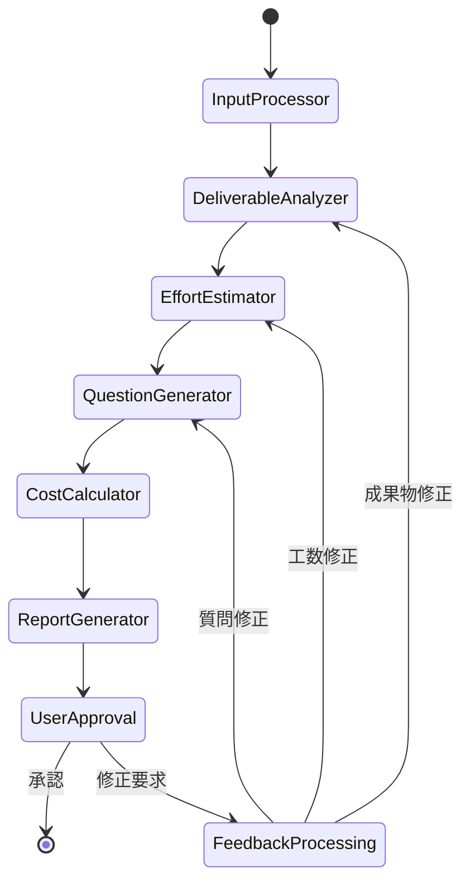

# システムアーキテクチャ設計

## 🏢 システム全体構成

### **アーキテクチャ概要**
```
[Excel入力] + [システム要件] + [.env設定]
         ↓
[マルチエージェントシステム] → [LangGraphオーケストレーション]
         ↓
[Human-in-the-Loop] → [コンソール対話]
         ↓
[構造化Excel出力] → [見積前提条件付き]
```

### **データフロー**
```
1. Input Processor
   Excel(A:名称, B:説明) → 構造化データ
   システム要件テキスト → プロジェクトコンテキスト
   .env設定 → 経済パラメータ

2. Deliverable Analyzer
   成果物分析 → 複雑度・リスク評価
   プロジェクトコンテキスト → 技術適合性評価

3. Effort Estimator
   工数算出 → 複雑度・リスク調整
   過去実績データ → 精度検証

4. Question Generator
   動的質問生成 → 精度向上
   ユーザー対話 → 前提条件確定

5. Report Generator
   コンソール出力 → ユーザー承認
   Excel出力 → 見積前提条件付き
```

## 🔄 システムフロー

### **メインワークフロー**


### **データスキーマ**
```yaml
# システム状態管理
EstimationState:
  excel_input: str
  system_requirements: str
  deliverables: List[Deliverable]
  analyzed_deliverables: List[AnalyzedDeliverable]
  effort_estimates: List[EffortEstimate]
  cost_calculation: CostCalculation
  user_feedback: str
  approved: bool
  iteration_count: int
  final_excel_output: str

# 成果物データ構造
Deliverable:
  name: str
  description: str
  category: str
  complexity_level: str
  risk_factors: List[str]
  dependencies: List[str]

# 工数見積データ構造
EffortEstimate:
  deliverable_name: str
  base_effort_days: float
  complexity_adjustment: float
  risk_buffer: float
  final_effort_days: float
  confidence_level: str
  rationale: str

# コスト計算データ構造
CostCalculation:
  deliverable_costs: List[DeliverableCost]
  financial_summary: FinancialSummary
  session_metadata: SessionMetadata
```

## 🔧 ツール統合アーキテクチャ

### **コアツール**
1. **Excel処理ツール**
   - pandas: データ読み込み・加工
   - openpyxl: Excelファイル操作
   - xlsxwriter: 高品質出力フォーマット

2. **成果物ナレッジDB**
   - SQLite: 過去実績データ倉庫
   - 類似成果物検索機能
   - 工数正解データ蓄積

3. **AI解析ツール**
   - OpenAI API: GPT-4o-mini
   - 自然言語処理パイプライン
   - 意味解析・構造化

4. **コスト算出ツール**
   - 非AI数値計算エンジン
   - 人日単価・税率適用
   - 通貨・国際化対応

5. **環境設定ツール**
   - python-dotenv: 設定管理
   - モデル・言語・通貨設定
   - APIキーセキュリティ管理

## 🔒 セキュリティ・エラーハンドリング

### **セキュリティ対策**
- APIキーの環境変数管理
- センシティブデータのログ除外
- ファイル入出力権限管理
- ユーザー入力バリデーション

### **エラーハンドリング戦略**
- Excelファイルフォーマットエラー
- APIレートリミット・タイムアウト
- ユーザー入力バリデーションエラー
- システムリソース不足エラー

## 📊 パフォーマンス要件

### **レスポンスタイム**
- 基本見積完了: < 30分（HITL除く）
- Excel出力生成: < 10秒
- システム起動時間: < 30秒

### **スケーラビリティ**
- 最大成果物数: 100件
- 同時セッション数: 5セッション
- メモリ使用量: < 2GB

### **精度目標**
- 見積精度: 乖離率 < 15%
- ユーザー承認率: > 90%
- システム可用性: > 99%

---
**作成日**: 2025年7月9日  
**バージョン**: 1.0